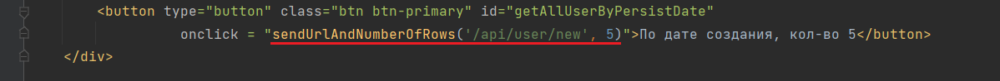
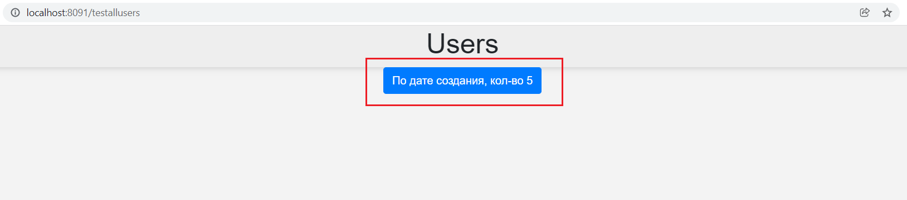
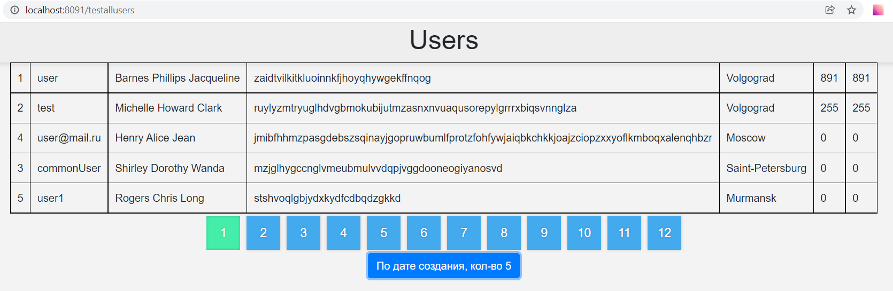

## Сущности

### User

#### Поля:

- **id** - уникальный идентификационный номер пользователя;
- **name** - уникальное имя пользователя;
- **age** - возраст;
- **email** - адрес электронной почты;
- **password** - пароль;
- **persistDateTime** - дата регистрации;
- **isEnabled** - отметка, что учетная запись не заблокирована;
- **isDeleted** - отметка, что учетная запись не удалена;
- **city** - город пользователя;
- **linkSite** - ссылка на сайт пользователя;
- **linkGitHub** - ссылка на github;
- **linkVk** - ссылка на страницу во Вконтакте;
- **about** - краткая информация о пользователе;
- **imageLink** - ссылка на фотографию пользователя;
- **lastUpdateDateTime** - дата последней авторизации;
- **nickname** - никнейм пользователя;
- **roles** - роли пользователя;

```
Пользователь может задавать вопросы, отвечать на вопросы.
Наделен ролями.Может голосовать за вопросы и ответы.
```

### Role

#### Поля:

- **id** - уникальный идентификационный номер роли;
- **role** - имя роли;

```
Определяет порядок прав действий пользователя в системе.
```

### Users_Roles

#### Поля

- **user_id** - идентификационный номер пользователя;
- **role_id** - идентификационный номер роли;

```                                                  
Производная таблица связи many-to-many сущности пользователя и ролей.
```

### Question

#### Поля:

- **id** - уникальный идентификационный номер вопроса;
- **title** - заголовок вопроса;
- **description** - описание вопроса;
- **persistDateTime** - дата публикации вопроса;
- **user** - идентификационный номер пользователя, опубликовавший вопрос;
- **tags** - теги, которыми обозначен вопрос;
- **lastUpdateDateTime** - дата последней редакции вопроса или добавления ответа;
- **isDeleted** - флаг, помечающий объект, как удалённый. Отображаться при запросе данный вопрос не будет;
- **answers** - ответы на вопрос;
- **commentQuestions** - комментарии к вопросу.
- **userFavoriteQuestions** - список понравившихся пользователю вопросов.
- **voteQuestions** - записи голосований по вопросу.

```
Сущность, которую инициализирует пользователь для публикации своего вопроса. Имеет заголовок, который кратко 
описывает суть вопроса, развернутое описание, с возможностью вставки фрагмента кода, тэги 
```

### VoteQuestion

#### Поля

- **id** - уникальный идентификационный номер голоса;
- **user** - пользователь, который отправил свой голос;
- **question** - вопрос, по которому ведётся голосование;
- **localDateTime** - дата и время отправки голоса;
- **vote** - значение голоса, который отправил пользователь по вопросу;
```
Таблица, которая содержит в себе записи голосования пользователей по вопросам. 
Пользователь может проголосовать за один вопрос только с отклонением в 1 пункт. 
Изменить голос нельзя. 
Итоговое значение "полезности вопроса" является сумма всех голосов.
```

### Answer

#### Поля:

- **id** - уникальный идентификационный номер ответа;
- **persistDateTime** - дата публикации ответа;
- **updateDateTime** - дата публикации ответа;
- **question** - идентификационный номер вопроса, к которому относиться ответ;
- **user** - идентификационный номер пользователя, который опубликовал ответ;
- **htmlBody** - тело ответа;
- **isHelpful** - отметка, что именно этот ответ помог решить вопрос, к которому оно относиться. Эту
  отметку может ставить только автор вопроса;
- **isDeleted** - флаг, помечающий объект, как удалённый. Отображаться при запросе данный ответ не будет;
- **isDeletedByModerator** - флаг, помечающий объект, как удалённый модератором. Отображаться при запросе данный ответ не будет;
- **dateAcceptTime** - дата, решения вопроса;
- **commentAnswers** - комментарии к ответу.
- **voteAnswers** - голосование к ответу.
```
Сущность, которую инициализирует пользователь отвечая на вопрос. Привязан к сущности question. Ответ на
вопрос может оставлять любой пользователь. Может быть предложено несколько вариантов ответов на опубликованный
вопрос. Каждый пользователь может оставлять под вопросом только один ответ.
```
### VoteAnswer

#### Поля

- **id** - уникальный идентификационный номер ответа;
- **user** - пользователь, который отправил свой голос;
- **answer** - ответ, по которому ведётся голосование;
- **persistDateTime** - дата и время отправки голоса;
- **vote** - значение голоса, который отправил пользователь по ответу;
```
Таблица, которая содержит в себе записи голосования пользователей по ответам. Не допускается, что пользователь
может отменить свой голос. Все действия пользователя сохраняются в таблице.
```

### Tag

#### Поля:

- **id** - уникальный идентификационный номер тега;
- **name** - название тега;
- **description** - описание тега;
- **persistDateTime** - дата создания тега;
- **questions** - список вопросов, которыми помечен данный тег;
```
Ставиться у сущности question для классификации вопроса.
```

### Question_has_Tag

#### Поля

- **tag_id** - идентификационный номер тега;
- **question_id** - идентификационный номер вопроса;

```                                                  
Производная таблица связи many-to-many сущности вопросов и тегов.
```

### Reputation

#### Поля

- **id** - уникальный идентификационный номер репутации
- **persistDate** - дата создания
- **author** - идентификационный номер автора
- **sender** - идентификационный номер отправителя
- **count** - баллы заработанные за день
- **type** - тип репутации
- **question** - идентификационный номер вопроса
- **answer** - идентификационный номер ответа

```
Сущность, которая хранит в себе историю репутации пользователей по дням. 
Новый день новая запись, для каждого пользователя (если пользователь заработал баллы иначе записи не будет).  
```

## Правила написания тестов
1. Все классы для тестов находиться в папке **.../api**.
2. Тесты создаются согласно рест контроллерам. Например, если есть `ResourseAnswerController`, то есть тест `TestResourseAnswerController` и тестируются все api из контроллера.
3. Все тестовые классы должны наследоваться от абстрактного класса в котором описана все конфигурация тестов.
4. В пакете **dataset/expected** лежат все датасеты для сравнения получившейся базы данных после завершения теста. Данные датесеты не используются для обычной загрузки данных для тестов и используются только для операций DELETE, UPDATE, PERSIST.
5. Все сущности описанные в датасетах для загрузки тестовых данных начинаются с `id = 100` (никакого отношение к датасетам из expected не имеет).
6. **НЕЛЬЗЯ ИЗМЕНЯТЬ УЖЕ  НАПИСАННЫЕ ДАТАСЕТЫ!** Если хотите добавить данные, создаете подпакет для вашего конкретного теста и пишите свои датасеты для этого теста.
7. На каждый класс тестов написаны отдельные датасеты, в случае где их нужно изменить применяется **п.5**. Например, если мы тестируем `ResourseAnswerController`, есть подпакет **dataset/[название пакета]** и тут лежат все датасеты нужные для тестирования этого контроллера.
8. Нельзя использовать аннотацию **@Transactional** для тестов.
9. Нельзя ставить аннотацию **@DataSet** над классом, для каждого отдельного метода теста стоит свой датасет.


## Пагинация на фронте (JS)


2. Функция **sendUrlAndNumberOfRows** позволяет универсально настроить пагинацию для любого контроллера

   a) принимает в параметры:
    - адрес контроллера ```/api/user/new```
    - количество объектов для показа на странице ```5```

   b) запускает следующие функции:
    - **getTotalCountOfItems**
    - **displayList**
    - **setupPagination**
3. Функция **getTotalCountOfItems** делает запрос на контроллер ```/api/user/new?currPage=1``` и возвращает общее количество объектов одним значением ```60```


4. Функция **displayList** динамически создает таблицу и заполняет ее всеми доступными значениями объектов на одной странице

   a) принимает параметры:
    - элемент страницы ```'table'```
    - количество объектов на странице ```5```

   b) ждет исполнения функции **getItemsForPage** - получение от контроллера объектов для одной страницы по **динамическому url** ```/api/user/new?currPage=1&items=5```
5. Функция **setupPagination** - создает все кнопки с номерами страниц

   a) принимает параметр: элемент страницы ```'pagination'```

   b) для создания каждой новой кнопки ожидает исполнения функции **paginationButton**
    - принимает параметр с номером страницы и ограниченный общим количеством возможных страниц (```60/5=12```)
    - ожидает исполнения функции **getItemsForPage** для каждой новой страницы при переходе
    - добавляет ```'active'``` для активной страницы
      


